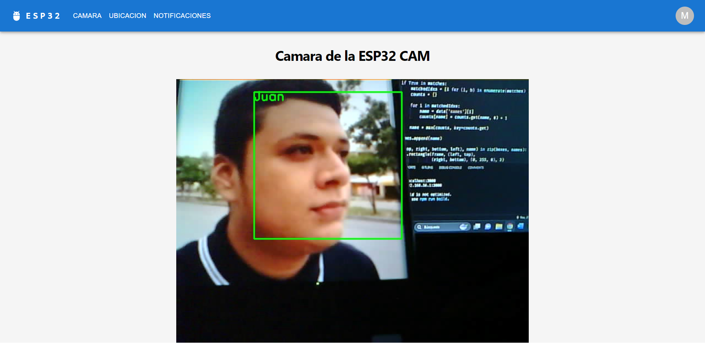
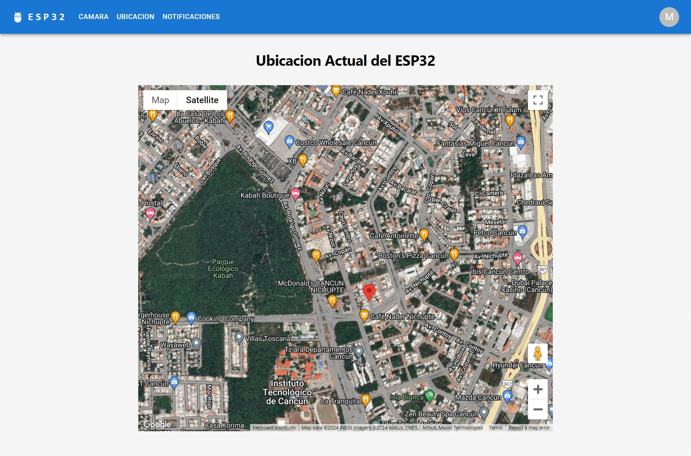
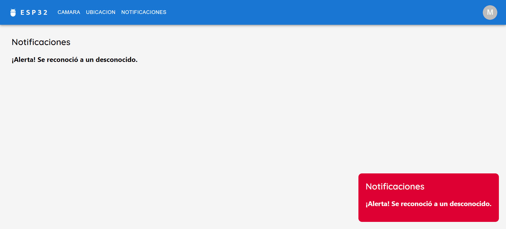

# Sistema de Seguridad ESP32

## Descripción

Este sistema de seguridad integrado utiliza ESP32 para monitorear y notificar eventos de seguridad en tiempo real. Implementado con tecnologías como React para la interfaz de usuario y Flask en el servidor, este sistema ofrece reconocimiento facial, notificaciones en tiempo real y localización en un mapa interactivo.

## Funcionalidades

- **Reconocimiento facial**: Identifica personas en tiempo real utilizando una cámara conectada al ESP32 Cam.
- **Notificaciones en tiempo real**: Envía alertas inmediatas cuando se detecta una persona no reconocida.
- **Visualización de la ubicación**: Muestra la ubicación actual de la cámara en un mapa interactivo, permitiendo un seguimiento detallado en caso de alerta.

## Capturas de Pantalla

### Cámara de seguridad



### Ubicacion de la cámara



### Notificacion de intruso



## Prerrequisitos

Antes de iniciar, asegúrate de tener instalado lo siguiente:

- [Node.js](https://nodejs.org/en/)
- [npm](https://www.npmjs.com/)
- [Git](https://git-scm.com/)
- [Python](https://www.python.org/)

Puedes verificar las instalaciones con los siguientes comandos:

```bash
node --version
npm --version
git --version
python --version
```

Asegúrate de establecer la variable de entorno `REACT_APP_GOOGLE_MAPS_API` con tu clave del API de Google Maps en un archivo `.env` en la raiz del proyecto.

```python
REACT_APP_GOOGLE_MAPS_API="your-api-key-here"
```

Para ejecutar el `index.py` neceitaras las sigueintes librerias instaladas en python.

```python
from flask import Flask, Response, jsonify
import cv2
import face_recognition
import pickle
from flask_cors import CORS
```

## Comenzando

### Instalación

Para desplegar el proyecto en tu entorno local para desarrollo y pruebas, sigue estos pasos:

1. Clona el repositorio:

```bash
git clone https://github.com/marcosd59/esp32-security-system.git
```

2. Navega al directorio del proyecto:

```bash
cd esp32-security-system
```

3. Instala las dependencias:

```bash
npm install
```

4. Inicia el servidor de desarrollo:

```bash
npm start
```

5. Ejecuta el archivo `index.py` para inicar el servidor con la decodificaion de rostros.

6. Abre `http://localhost:3000` en tu navegador para ver la aplicación.

## Herramientas Utilizadas

- [React](https://reactjs.org/)
- [Material UI V5](https://mui.com/)
- [Flask](http://flask.pocoo.org/)
- [OpenCV](https://opencv.org/)
- [face_recognition](https://github.com/ageitgey/face_recognition)
- [Google Maps API](https://console.cloud.google.com/apis/library/maps-backend.googleapis.com?hl=es-419&project=dulcet-library-418317)

## Contribuir

Las contribuciones son bienvenidas y ayudan a mejorar y expandir este proyecto. Si deseas contribuir, puedes seguir estos pasos:

1. **Fork** el repositorio.
2. Crea tu **Feature Branch** (`git checkout -b feature/AmazingFeature`).
3. Haz tus **cambios** en el código.
4. **Commit** tus cambios (`git commit -m 'Add some AmazingFeature'`).
5. **Push** a la rama (`git push origin feature/AmazingFeature`).
6. Abre un **Pull Request**.

## Contacto

- **Nombre**: Marcos Damián Pool Canul
- **Correo Electrónico**: <damian.marcospool@gmail.com>
- **GitHub**: [marrcosd59](https://github.com/marcosd59)

---

© 2024 Marcos Damián Pool Canul.

```bash
git clone https://github.com/marcosd59/esp32-security-system.git
```
